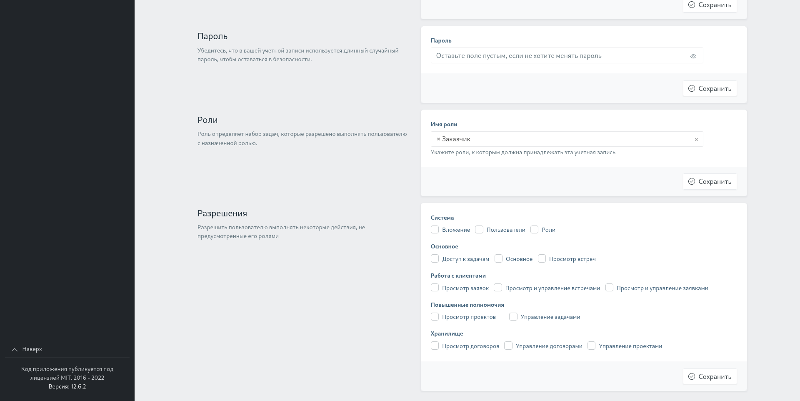

# WebDevCompany

## Обзор
Проект представляет собой сайт компании, которая занимается разработкой IT проектов. Включает в себя две части: незамысловатую пользовательскую и административную, над которой и велась основная работа.

Типичная работа с сайтом состоит из следующих действий
1. Заказчик заходит на сайт и получает информацию об услугах компании.
2. Регистрируется и оставляет заявку на личную встречу с представителем компании, дав краткое описание задачи.
3. Сотрудник компании обрабатывает заявку, и заказчик получает положительный или отрицательный ответ на организацию встречи. Если ответ положительный - назначается сотрудник, который, непосредственно и будет присутствовать на встрече с заказчиком.
4. После встречи, если стороны договорились на выполнение проекта - начинается работа над проектом
5. Заказчик получает готовый проект.

**Ключевые функции проекта:**
* Роли, позволяющие настроить уровень доступа для каждого пользователя.
* Назначение задач сотрудникам, организация встреч с заказчиком, работа с лидами, работа с проектами и договорами, прикрепление сотрудников к проекту
* Отслеживания статуса каждой сущности в течение ее жизненного цикла.
* Просмотр статистической информации по сущностям.
* Уведомления, приходящие пользователям, когда произошло действие, связанное с ними.
* Фильтры по каждой модели для удобства просмотра.
* Просмотр, создание, редактирование, удаление каждой сущности.

Ниже прикреплены скриншоты, демонстрирующие часть функционала. 





## Запуск и настройка

1. Для запуска проекта на компьютере должен быть установлен [Docker](https://www.docker.com/) и [docker-compose](https://docs.docker.com/compose/install/), выполните следующие команды из корневой директории проекта:

```bash
# Сборка и запуск контейнеров
docker-compose up -d --build

# Только для Linux
# Передача прав от root пользователя локальному пользователю для доступа к папкам с проектом и базы данных
sudo chown $USER:$USER db src

# Установка пакетов composer
docker-compose run --rm composer install

# Установка пакетов NPM
docker-compose run --rm npm install

# Сборка CSS и JS файлов
docker-compose run --rm npm run dev 
```

2. В папке **src** переименовать файл **.env.example** в **.env**

3. Внутри контейнера web выполнить миграции и генерацию ключа для Laravel
```
# Вход в контейнер web
docker-compose exec web bash

# Генерация ключа Laravel
php artisan key:generate

# Выполнение миграций
php artisan migrate

# Выход из контейнера
exit
```

### Порты

После выполнения вышеописанных команд сервисы будут доступны по следующим портам:
```
8000:apache
3601:mariadb
```
Соответственно, для того чтобы попать на главную страницу проекта перейдите по адресу http://localhost:8000/, а для получения доступа к базе данных воспользуйтесь любым средством администрирования баз данных, к примеру [DBeaver](https://dbeaver.io/), используя имя пользователя и пароль **root:root**

## Выполнение команд из терминала
### Composer/npm

При надобности использовать composer или npm используются следующие команды:
```
docker-compose run --rm composer ...
```
```
docker-compose run --rm npm ...
```

### Выполнение PHP

Для выполнения php команд необходимо войти в контейнер и выполнять команды внутри него:
```
# Вход в контейнер
docker-compose exec web bash

# Как пример, выполнение миграции
php artisan migrate

# Выход из контейнера
exit
```

## Генерация данных
Для наполнения базы данных случайными данными вы можете воспользоваться командой
```
# Внутри web контейнера
php artisan db:seed
```
### Права
После генерации данных вам будет доступен **аккаунт администратора**:
```
admin@admin.com
password
```
Авторизовавшись через него вы получите доступ к админ-панели, перейти в нее можно по ссылке в шапке на главной странице, либо перейдя по URL [localhost:8000/admin](http://localhost:8000/admin). Также после генерации данных всем ролям будет выдан определенный набор прав, рекомендуется проверить его и изменить, при необходимости.